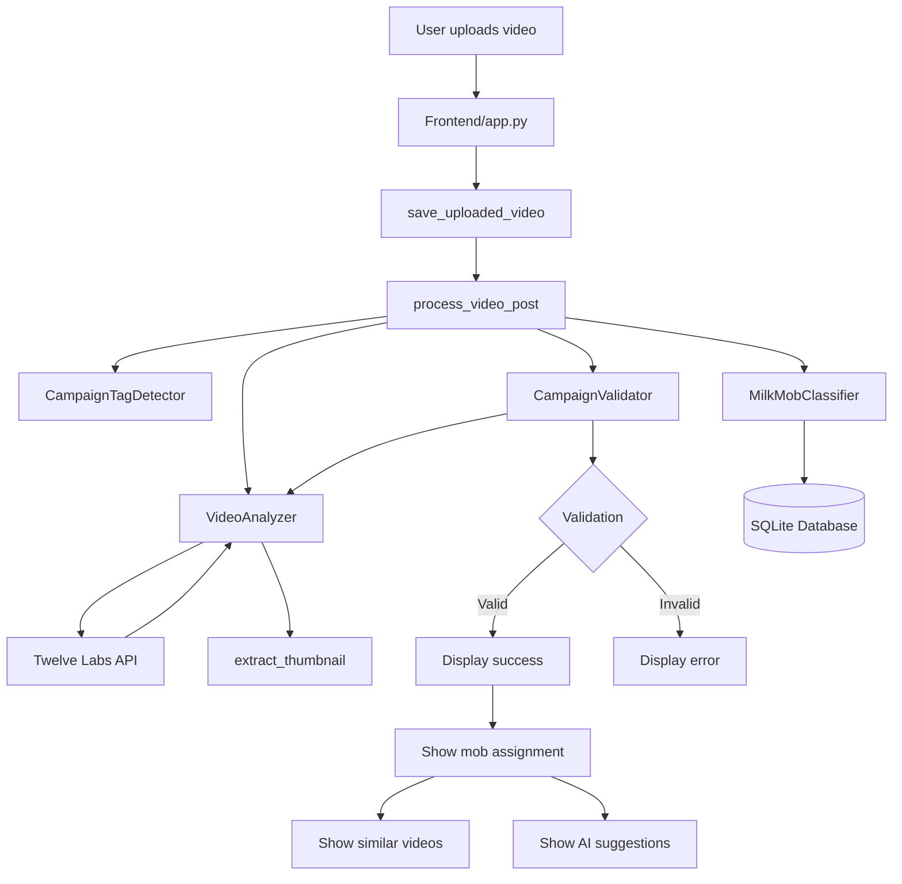

# MilkMob - Video Campaign Platform

MilkMob is a prototype social media tool that automatically validates and categorizes creative milk drinking videos using the Twelve Labs video understanding API. It groups content into themed "Milk Mobs" to encourage community engagement.

## Table of Contents
- [Overview](#overview)
- [Project Structure](#project-structure)
- [Prerequisites](#prerequisites)
- [Installation](#installation)
- [Running the App](#running-the-app)
- [How It Works](#how-it-works)
- [Detailed Code Flow](#detailed-code-flow)
- [System Architecture](#system-architecture)
- [Key Components](#key-components)
- [Example Usage](#example-usage)
- [API Usage Notes](#api-usage-notes)
- [Dependencies](#dependencies)
- [Contributing](#contributing)

## Overview
This solution enables a social media platform to automatically validate user-submitted videos showing creative milk drinking, categorize them into thematic "Milk Mobs," and create an engaging community experience. It relies on Twelve Labs' AI video understanding capabilities to:
- Detect milk-drinking activities
- Assess the creativity of submissions
- Classify valid videos into thematic mobs based on content
- Find similar videos within each mob

## Project Structure
backend/     # Core business logic and API integrations
├── __init__.py          # Exports main components
├── analyzer.py          # VideoAnalyzer - Twelve Labs SDK integration
├── validator.py         # CampaignValidator - Campaign criteria checking
├── classifier.py        # MilkMobClassifier - Video grouping and database ops
├── tag_detector.py      # CampaignTagDetector - Hashtag recognition
├── video_utils.py       # Video processing utilities
└── migrate_db.py        # Database migration tool

frontend/    # Streamlit UI components
├── app.py               # Main application with three tabs
└── explore_tab.py       # Enhanced Milk Mobs exploration interface

videos/      # Storage for uploaded videos (created on first use)
thumbnails/  # Storage for video thumbnails (created on first use)
milk_mobs.db # SQLite database for mobs and videos (created automatically)

## Prerequisites
- Python 3.9 or newer
- Twelve Labs account and API key
- Optional: `ffmpeg` for enhanced video processing

## Installation
1. **Clone the repository**
   ```bash
   git clone <repo-url>
   cd milkmob
   ```
2. **Install dependencies**
   ```bash
   pip install -r requirements.txt
   ```
3. **Set environment variables**
   Create a `.env` file with your Twelve Labs credentials:
   ```
   TWELVE_LABS_API_KEY=your_api_key
   TWELVE_LABS_INDEX_ID=milk_campaign_index
   ```
 
## Database Migration
If you used a previous version of MilkMob, your `milk_mobs.db` may lack new columns. Run `python backend/migrate_db.py` to upgrade the schema or delete the old file to let the app recreate it.

## Running the App
Start the Streamlit application from the project root:
```bash
streamlit run frontend/app.py
```
The UI provides tabs for uploading videos, exploring mobs, and viewing dashboard analytics.

## How It Works
1. **Upload & Tag Detection** – Users upload a video with caption and hashtags.
2. **Video Analysis** – The Twelve Labs SDK analyzes the content for milk-drinking activity and creative elements.
3. **Campaign Validation** – Videos that meet campaign rules are marked valid.
4. **Mob Classification** – Valid content is organized into a themed Milk Mob.
5. **Content Exploration** – Users browse their mob and discover similar videos.

## Detailed Code Flow

### Video Upload and Processing Flow
1. User uploads a video through the Streamlit interface in `frontend/app.py`
2. The uploaded file is saved to disk using `save_uploaded_video()` from `backend/video_utils.py`
3. Post metadata (caption, hashtags, location) is collected from the user interface
4. The `process_video_post()` function orchestrates the entire processing pipeline:

   a. **Campaign Tag Detection**:
      - `CampaignTagDetector.detect_tags()` identifies hashtags like #gotmilk, #milkmob
      - Tag confidence score is calculated based on number of matching tags

   b. **Video Analysis with Twelve Labs**:
      - `VideoAnalyzer.upload_and_analyze_video()` uploads the video to Twelve Labs
      - API tasks are created and tracked until completion
      - Comprehensive analysis performed via multiple API calls:
        - Visual search for milk-related objects and drinking activities
        - Audio search for milk-related mentions
        - Summary and highlight generation
        - Creative assessment and scoring
        - Optional caption and storyboard generation
      - Additional AI gist (title, topics, hashtags) generated using `generate_video_gist()`

   c. **Campaign Validation**:
      - `CampaignValidator.validate_video()` validates if video meets campaign criteria
      - Uses both rule-based validation and optional AI-assisted validation with OpenAI
      - Checks for milk presence, drinking activity, and creative elements
      - Assesses if video shows milk drinking vs. food preparation

   d. **Milk Mob Classification**:
      - `MilkMobClassifier.classify_video()` assigns video to a thematic "Milk Mob"
      - Uses content embeddings to find similar videos and matching mobs
      - Creates new mobs with AI-generated names/descriptions when needed
      - Stores video metadata, embeddings, and mob assignments in SQLite database

   e. **Similar Content Detection**:
      - `VideoAnalyzer.find_similar_videos()` identifies similar videos in the database
      - Returns a list of related content to show the user

5. Results are displayed in the Streamlit UI:
   - Validation status (success/failure)
   - Mob assignment with thematic colors and icons
   - Similar videos within the assigned mob
   - AI-generated content suggestions
   - Technical details of the analysis

### Database Interactions
- `MilkMobClassifier` manages all database operations:
  - Stores video metadata, embeddings, and mob assignments
  - Retrieves mob information and video lists
  - Updates mob centroids as new videos are added
  - Tracks video counts and creativity scores

### Explore and Dashboard Features
- The "Explore Milk Mobs" tab in `frontend/explore_tab.py` displays:
  - All available mobs with their videos and keywords
  - Search functionality to find specific mobs or videos
  - Options to view mobs in compact or detailed mode
- The "Dashboard" tab visualizes campaign analytics:
  - Mob popularity metrics
  - Geographic distribution of content
  - Top creative videos
  - Campaign growth over time

## System Architecture



## Key Components
- **VideoAnalyzer** – Uploads and analyzes videos with Twelve Labs.
- **CampaignValidator** – Checks that videos meet required criteria.
- **MilkMobClassifier** – Assigns videos to themed mobs and stores results in SQLite.
- **CampaignTagDetector** – Extracts and tracks campaign hashtags.
- **Streamlit Frontend** – Presents an easy-to-use interface.

## Example Usage
### Uploading a Video
1. Open the **Upload & Validate** tab.
2. Select a creative video of milk drinking.
3. Add a caption, hashtags such as `#gotmilk` or `#milkmob`, and location info.
4. Click **Process Video**. If validated, the app assigns it to a mob and displays related videos.

### Exploring Mobs
1. Navigate to the **Explore Milk Mobs** tab.
2. Browse mob categories, example videos, and keywords.
3. Join a mob to participate and share similar content.

## API Usage Notes
The app leverages several Twelve Labs API endpoints through the SDK:

### Core API Endpoints
- `task.create` – Upload and index videos
- `search.query` – Find milk-related visual or audio content
- `generate.summarize` – Produce video summaries and highlights
- `generate.text` – Generate semantic analysis and creative assessment
- `search.vector` – Locate similar videos using embeddings
- `generate.gist` – Generate title, topics, and hashtags for videos
- `generate.caption` *(optional)* – Generate short captions
- `generate.storyboard` *(optional)* – Retrieve storyboard frames

### Key Integration Points
- **VideoAnalyzer** class (`backend/analyzer.py`) manages all API interactions:
  - Ensures proper index creation with required models
  - Uploads videos and tracks indexing progress
  - Performs multi-modal analysis (visual, audio)
  - Generates creative assessments with scoring
  - Retrieves video embeddings for similarity matching

- **CampaignValidator** class uses Twelve Labs responses to verify:
  - Presence of milk in the video (visual detection)
  - Drinking activities (action recognition)
  - Creative elements (semantic analysis)
  - Audio mentions of milk-related terms

The API responses power the Milk Mob classification system, which groups videos using embedding similarity, and the campaign validation system, which ensures content meets campaign requirements.

## Dependencies
- `streamlit` – Web app framework
- `twelvelabs` – Twelve Labs SDK
- `python-dotenv` – Environment variable loading
- `pandas` & `plotly` – Data visualization
- `sqlite3` – Database operations

## Contributing
Contributions are welcome! Feel free to open issues or pull requests to extend functionality, improve documentation, or report bugs.

